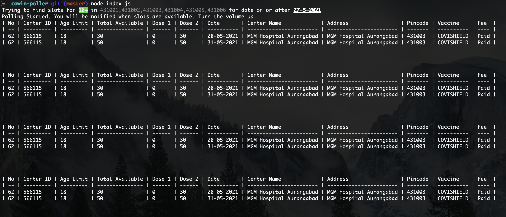

## COWIN Poller

#### Pre-requisites 
* node

#### Steps to run this app:
* `npm install`
* `node --experimental-json-modules index.js`

#### Apply filters
1. Go to `./presenter/Extractor.js`
2. You can set age filter and pin code filter
3. Also, check all the filters in `dataForPresenter` method.
4. You can also set frequency at which cowin website is polled in `./index.js`

### Defaults
* By default the app polls cowin website at every `5 sec` (Set `POLLING_FREQUENCY` variable in `index.js` to change this value)
* By default, the app polls centers from Aurangabad District (Set `DISTRICT_ID` variable in `index.js` to change this value)

The app reads `districtId` from a json file. Add json import support to the app using `--experimental-json-modules` flag 